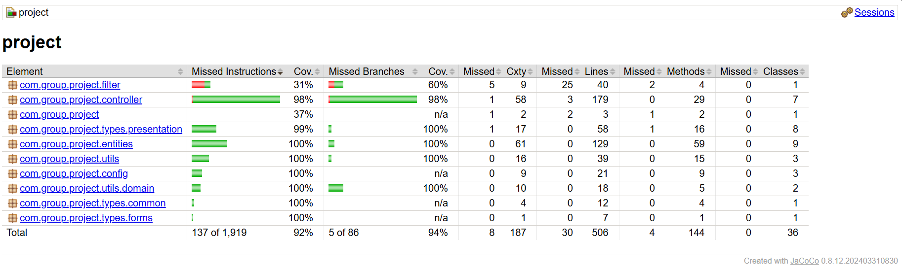
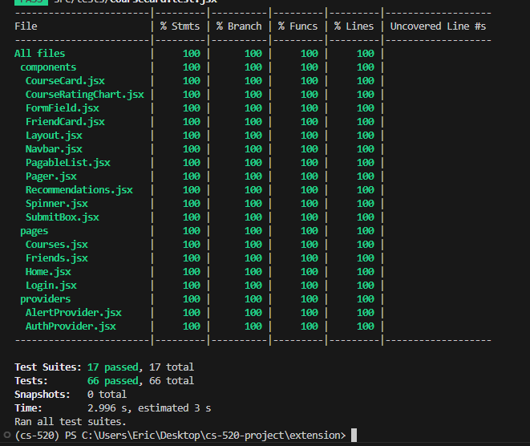

# Class Curator - A Spire Course Discovery Tool


## Introduction

**Class Curator** is a Chrome extension designed to make the course discovery process easier, more intuitive, and more social for UMass Amherst students. Finding courses that match your interests and coordinating selections with friends can be tedious and confusing, especially when using SPIRE. Class Curator integrates seamlessly with SPIRE to help you:

- Discover courses based on your preferences and history.
- Coordinate with friends by seeing their interests and selections.
- Streamline the course registration process within SPIRE.

This tool was developed by:

- **Eric Fournier**: [edfournier@umass.edu](mailto:edfournier@umass.edu)  
- **Liam Gates**: [lgates@umass.edu](mailto:lgates@umass.edu)  
- **Saloni Khatu**: [skhatu@umass.edu](mailto:skhatu@umass.edu)  
- **Harsh Seth**: [hseth@umass.edu](mailto:hseth@umass.edu)  


## Installation Instructions

Perform each of the following at the project's root:

1. **Populate the database**
```bash
python ./db-setup/db_populate.py
```

2. **Start the FastAPI recommendation service**
```bash
cd ./fast-api
pip install -r requirements.txt
fastapi run recommendations.py
```

2. **Start the Spring Boot backend**
```bash
cd ./spring-boot
mvn clean install
mvn spring-boot:run
```

3. **Build the extension**
```bash
cd ./extension
npm i
npm run build
```

This final step builds an `extension/dist` directory. After it's built, open Chrome, and navigate to `chrome://extensions/`. Then, enable `Developer Mode`, press `Load unpacked`, and load the `dist` directory on your machine. The extension will now be accessible in Chrome's "Extensions" tab in the top-right of the browser.


## Configuration

#### Spring Boot Configuration
_Runtime Setup_

The Spring Boot server requires a JDK and JRE version 23 or higher. Additionally, we recommend having Maven v3.5 or higher. Any required external dependencies are listed in the `pom.xml` file and will be installed as part of `mvn spring-boot:run`

_Changing the Default Port_

The server attempts to start on the `8080` port. 
If you wish to application to start on a different port, add in the following to the `application.yaml` file

```yaml
server:
     port: <new_port>
```

_Domain Defaults_

New Users -
New users are created with some values for Graduation Semester and Major. These defaults can be changed in the `application.yaml` file under the `domain.defaults.user` section

#### Extension Configuration
The extension expects an environment variable `VITE_BACKEND_URL`, which should be set to the hostname of the Spring Boot server. This can be configured in `extension/.env`.

3. **FastAPI Configuration**:
It is recommended to use a virtual environment before installing any dependencies using this feature, which can be done using the following commands:
```bash
python -m venv ./venv
source venv/bin/activate
```


## Datasets
To generate insights and recommendations, the backend leverages historical review data from [Rate My Professor](https://www.ratemyprofessors.com/) and course data from Daniel Melanson's [Spire API](https://github.com/daniel-melanson/spire-api.melanson.dev). The scripts to generate these data sets, `rmp.py` and `spire.py` respectively, are found in `db-setup/scrape`. 


## Large Language Model Used
The system uses *all-MiniLM-L6-v2* model, a sentence transformer, which maps sentences and paragraphs to a 384 dimensional vector space. The system generates recommendations using processed course-related data. This model provides efficient performance for tasks like semantic search and embedding generation.


## Test Suites
1. **Backend Tests**: Tests covering all 36 classes is present at `spring-boot/src/test`. These tests extensively cover application behavior across all the features - **Course Search**, **Course Rating**, **Course Interests**, **User Search**, **Friendship Management**, **Friend Request Management**, **Course Insights**, **Course Recommendations** and **Authentication**

To run the tests:
```bash
cd ./server
mvn clean test
```

As the below test run results show, we've achieved 92% line coverage and 94% branch coverage as of writing this section



2. **Extension Tests**: A Jest test suite is provided in `extension/src/tests`. Each component was tested for edge cases and error scenarios, with mocking used for API calls. To run the suite:
```bash
cd ./extension
npm i
npm test
```


3. **FastAPI Tests**: The pytest test for the recommendation feature is provided in `test_recommendations.py`. To run the test:
```bash
cd ./fast-api
python3.11 -m pytest
```
To run the test with a code coverage report:
```bash
cd ./fast-api
python3.11 -m pytest --cov recommendations test_recommendations.py
```


## Demo Videos
[Application Setup and Backend Infra](https://drive.google.com/file/d/1uF5qFFuqfKGHbezvw-6q8K14wI9wjYpi/view?usp=sharing)
[Frontend Infra and Testing](https://drive.google.com/file/d/1_wo6RSKMsuVOWwoNzQRt8YCDiDntcjQi/view?usp=sharing)
